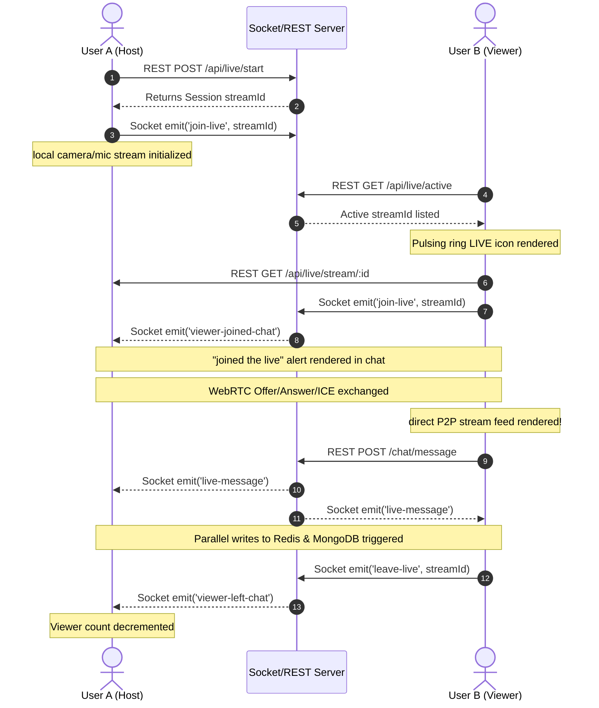

# 🎥 Social Square — Live Stream System: Complete Flow

## Table of Contents
1. [Architecture Overview](#architecture-overview)
2. [Tech Stack](#tech-stack)
3. [Database Models](#database-models)
4. [REST API Endpoints](#rest-api-endpoints)
5. [Socket.io Events](#socketio-events)
6. [Frontend Components](#frontend-components)
7. [Complete End-to-End Flow](#complete-end-to-end-flow)
8. [WebRTC Signaling Deep Dive](#webrtc-signaling-deep-dive)
9. [High-Performance Live Chat (Sockets + REST)](#high-performance-live-chat-sockets--rest)
10. [Host Resiliency & Reconnect Recovery (Auto-End)](#host-resiliency--reconnect-recovery-auto-end)
11. [State Management](#state-management)
12. [How to Test](#how-to-test)

---

## Architecture Overview

Social Square live streaming is built on **three pillars**:

| Pillar | Technology | Purpose |
+|--------|-----------|---------|
| **Signaling** | Socket.io | Exchange WebRTC offers, answers, ICE candidates, and pause states |
| **Media Transport** | WebRTC (P2P) | Stream raw camera/mic video/audio directly between host and viewers |
| **Real-time Chat** | Socket.io / REST | Send/receive chat messages with sub-10ms delivery and hot/cold database persistence |

```
┌─────────────┐          Socket.io           ┌─────────────────┐
│   HOST      │  ◄───── signaling ─────────► │   NODE SERVER   │
│  (Browser)  │                              │   (index.js)    │
└─────────────┘                              └─────────────────┘
       │                                              │
       │  WebRTC P2P (video/audio feed)               │ Socket.io signaling
       │                                              │
       ▼                                              ▼
┌─────────────┐          Socket.io           ┌─────────────────┐
│   VIEWER    │  ◄───── signaling ─────────► │   NODE SERVER   │
│  (Browser)  │                              │   (index.js)    │
└─────────────┘                              └─────────────────┘
       │                                              ▲
       │ REST GET /chat/history                       │ REST POST /chat/message
       ▼                                              │
┌──────────────────────────┐                          │
│   Redis / MongoDB        │ ─────────────────────────┘
│   History load on Join   │
└──────────────────────────┘
```

---

## Tech Stack

| Layer | Technology |
|-------|-----------|
| Backend server | Node.js + Express |
| Real-time signaling | Socket.io |
| Video transport | WebRTC (`RTCPeerConnection`) |
| NAT traversal | Google STUN servers |
| Hot Cache (In-Memory) | Redis (100 messages limit per stream) |
| Cold Archive (Persistence) | MongoDB (via Mongoose) |
| Frontend framework | React |
| Global UI state | Zustand (`usePostStore`) |

---

## Database Models

### Live Stream Session
**File:** [LiveStream.js](file:///d:/Personal/Social-Square-Social-Media-Plateform/backend/models/LiveStream.js)
```js
{
  host:      ObjectId → User,  // The person who is streaming
  status:    String,           // 'active' | 'ended'
  viewers:   [ObjectId → User],// Viewers in stream
  title:     String,           // e.g. "John's Live Stream"
  startTime: Date,             // Auto-set on start
  endTime:   Date              // Set when ended
}
```

### Live Chat Archive (MongoDB Cold Storage)
**File:** [LiveChatMessage.js](file:///d:/Personal/Social-Square-Social-Media-Plateform/backend/models/LiveChatMessage.js)
```js
{
  streamId:  ObjectId → LiveStream, // Live Session link
  user: {
    id: ObjectId → User,
    fullname: String,
    profile_picture: String
  },
  text:      String,                 // Message text body
  timestamp: Date                    // Auto-set creation date
}
// Optimized Index: { streamId: 1, createdAt: 1 }
```

---

## REST API Endpoints

**Base path:** `/api/live`

### `GET /active`
Returns all active live streams from following users or the user themselves, sorting by newest start times.

### `POST /start`
Creates a new live stream session. Clears prior active streams, starts WebRTC signaling, and triggers an in-app system notification to followers.

### `POST /end/:id`
Host closes the stream session. Status updates to `'ended'` in MongoDB.

### `GET /stream/:id`
Fetches stream details populated with host details.

### `GET /:id/chat/history`
Loads chat history. Fetches the latest 100 messages from **Redis hot cache** first. If empty or disabled, falls back to **MongoDB cold storage** (archiving up to 500 messages) in chronological order.

### `POST /:id/chat/message`
Sends a live chat message. Emits the message immediately over the real-time Socket room to everyone, and initiates async background parallel database persistence (Redis hot list + MongoDB document save) in a non-blocking path.

---

## Socket.io Events

### Client → Server

| Event | Payload | Description |
|-------|---------|-------------|
| `join-live` | `streamId` | Join room `live:<streamId>`. Triggers enter chat broadcast. |
| `leave-live` | `streamId` | Leave room. Triggers exit chat broadcast. |
| `live-offer` | `{ to, offer }` | WebRTC offer SDP relayed to host. |
| `live-answer` | `{ to, answer }` | WebRTC answer SDP relayed to viewer. |
| `ice-candidate` | `{ to, candidate }` | ICE Candidate relayed to peer. |
| `live-ended` | `streamId` | Host closed stream overlay broadcast. |
| `live-paused` | `streamId` | Host toggled A/V tracks off (pause overlay). |
| `live-resumed` | `streamId` | Host toggled A/V tracks back on. |

### Server → Client

| Event | Payload | Description |
|-------|---------|-------------|
| `viewer-joined` | `{ viewerCount }` | Total active watchers count. Excludes host. |
| `viewer-joined-chat` | `{ userId, fullname, profile_picture }` | Instagram-style user joined alert. |
| `viewer-left-chat` | `{ userId, fullname, profile_picture }` | Instagram-style user left alert. |
| `live-message` | `{ id, text, user, timestamp }` | Real-time chat message delivery. |

---

## Frontend Components

### 1. `Stories.js` (Stories & Live Hub)
**File:** [Stories.js](file:///d:/Personal/Social-Square-Social-Media-Plateform/socialsquare/src/pages/components/Stories.js)
* **Stories Tray:** Located at the top of the feed page.
* **Go Live Button:** Placed inside the **Create Story** modal panel under an elegant divider line, providing a natural unified creation flow.
* **Live Previews:** Shows active followings streams with a **pulsing gradient ring overlay** and a `LIVE` tag badge.

### 2. `LiveStream.js` (Audio/Video Player + Interactivity)
**File:** [LiveStream.js](file:///d:/Personal/Social-Square-Social-Media-Plateform/socialsquare/src/pages/components/LiveStream.js)
* **Host Interface:** Offers a dedicated Pause/Resume toggle, global viewer counter, and a red "End Live" button.
* **Viewer Interface:** Connects Peer Connection (`RTCPeerConnection`) to display remote feed, leaves instantly on cross button click.
* **Chat Overlay:** Renders chat bubbles and system notifications (*"fullname joined/left the live"*) in Instagram-style translucent layouts.

---

## Complete End-to-End Flow



---

## WebRTC Signaling Deep Dive
Signaling exchanges metadata (SDP session formats and ICE path coordinates) via WebSockets to enable direct peer-to-peer connection:
1. **Offer (Viewer):** Created with `offerToReceiveVideo: true` and `offerToReceiveAudio: true`, sent to the host.
2. **Answer (Host):** Host responds with its own local streams tracks mapped in.
3. **ICE Candidates:** Interactive Connectivity Establishment coordinates mapped dynamically to establish the optimal P2P stream path.

---

## High-Performance Live Chat (Sockets + REST)
Decoupled live chat architecture maximizes broadcast speeds and reduces DB latency:
* **Real-time Path:** Broadcasts incoming HTTP messages via `Socket.io` rooms in **<10ms** immediately to all subscribers.
* **Two-Layer Parallel Storage:** Write tasks are executed concurrently in a **non-blocking, async background worker thread**:
  * **Redis (Hot Cache):** Stores only the latest **500 messages** using fast in-memory commands (`LPUSH` and `LTRIM`).
  * **MongoDB (Cold Storage):** Saves full session archives for replays, logs, and moderation tools.
* **History Recovery:** On join, the client issues a single REST request to fetch the initial chat history from the hot Redis cache.
* **Deduplication Safeguard:** A client-side `seenIds` Set handles message deduplication, eliminating duplicate message rendering caused by socket/REST race conditions.
* **Redis-based Rate Limiter:** Protects endpoints from spammers by enforcing a maximum of 1 message per user per 500ms (`429 Too Many Requests`).

---

## Host Resiliency & Reconnect Recovery (Auto-End)
A resilient connection lifecycle manager protects streams against unexpected browser crashes, tab closure, or network dropouts:
* **Host Disconnection:** If the host's socket closes unexpectedly, the backend intercepts it, puts the stream in a paused state, and schedules a **30-second countdown recovery timer**.
* **Host Recovery:** If the host rejoins within the 30-second window, the timer is cleared, and it emits `live-host-recovered`.
* **WebRTC Re-Negotiation:** Viewers capture the `live-host-recovered` event, destroy their dead PeerConnection instances, and initiate a fresh `RTCPeerConnection` signaling offer back to the host, resuming media feeds automatically.
* **Auto-End Cleanup:** If the host remains offline beyond 30 seconds, the backend automatically transitions the DB status to `'ended'`, records `endTime`, and emits `live-ended` to viewers—terminating remote feeds cleanly.

---

## State Management
Zustand is used to manage live session states globally in [usePostStore.js](file:///d:/Personal/Social-Square-Social-Media-Plateform/socialsquare/src/store/zustand/usePostStore.js):
```js
// State variables
liveStreamId: "streamId" or null
isLiveHost: true or false

// Actions
setLiveStream(id, isHost)
clearLiveStream()
```

---

## How to Test
1. **Setup:** Ensure both backend and frontend dev servers are running.
2. **Going Live:** Log in as User A, open the **Create Story** popup, and click **Go Live**.
3. **Watching:** Log in as User B (following User A). User A's avatar will show a pulsing red glow. Click it to join.
4. **Chatting:** Send chat messages from both windows. Notice real-time delivery and join/leave status indicators in the scrolling layout.
5. **Testing Crash Recovery:** Close the tab of User A. Notice that User B gets a waiting screen. Re-open User A's tab within 30s to resume, or wait to see the stream auto-close.
