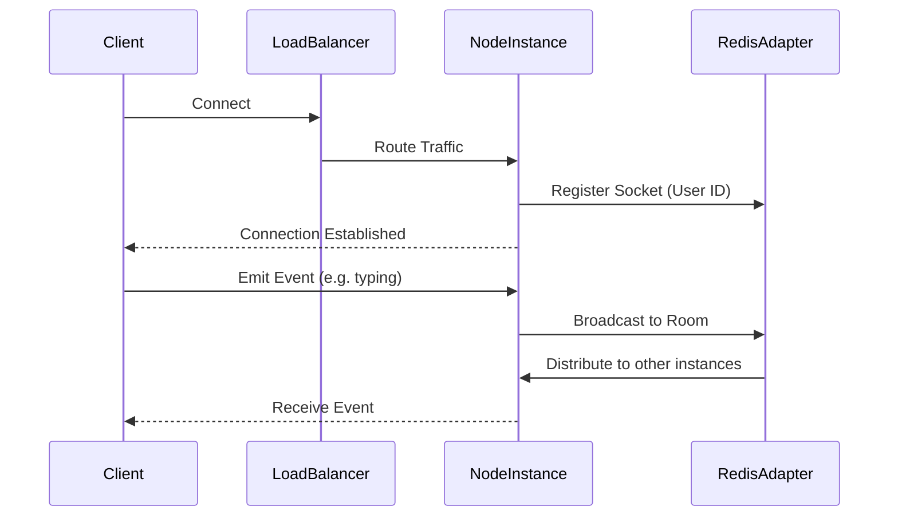
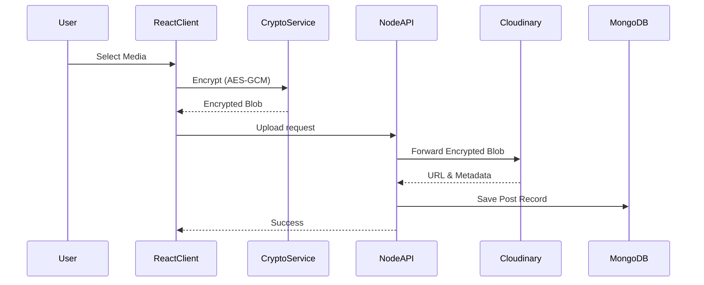
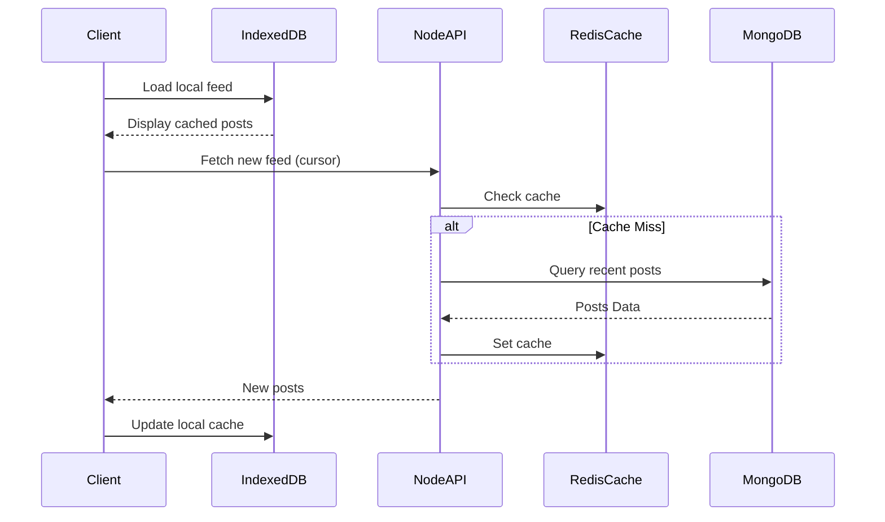
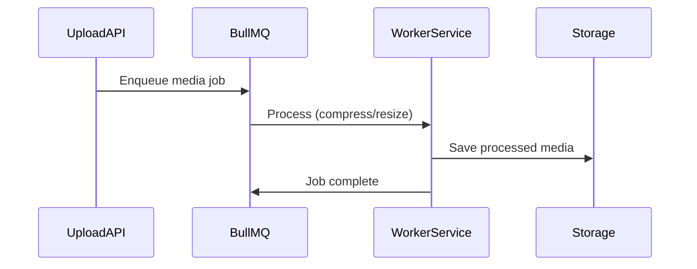

# Architecture

## High Level Architecture
Social Square utilizes a distributed, event-driven architecture designed for real-time interactions and high availability. The system is split into multiple microservices and background workers communicating via NATS and BullMQ.

## Frontend Architecture
The frontend is built with React, leveraging Zustand for ephemeral client state (UI state, drafts) and TanStack Query for server state (caching, background sync). It implements optimistic UI updates and uses the Broadcast Channel API to synchronize state across multiple tabs. IndexedDB provides robust offline capabilities.

## Backend Architecture
The backend consists of scalable Node.js/Express instances. It follows a Service-Oriented Architecture, utilizing a Middleware Pipeline, Repository Pattern for database operations, and an Event-Driven model for asynchronous processing.

## Architecture Diagrams

### Socket Flow

### Upload Flow

### Feed Loading Flow

### Media Processing Flow

