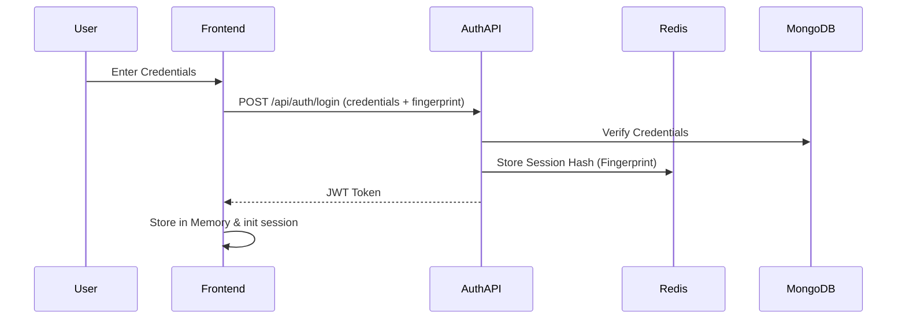

# Authentication

## Authentication Flow

### Problem
Securing user sessions across multiple devices while protecting against unauthorized access and tracking active logins.

### Implementation
The system uses a JWT-based authentication combined with session fingerprinting and Redis for active session management.

### Failure Handling
- **Invalid Credentials**: Returns 401 Unauthorized with generic message.
- **Unrecognized Fingerprint/IP**: Triggers Email-based 2FA (OTP) before granting a token.
- **Token Expiry**: Handled via silent refresh endpoint.

### Benefits
- Prevents session hijacking.
- Remote "Logout from all devices" capability via Redis invalidation.
- High security without compromising user experience.
