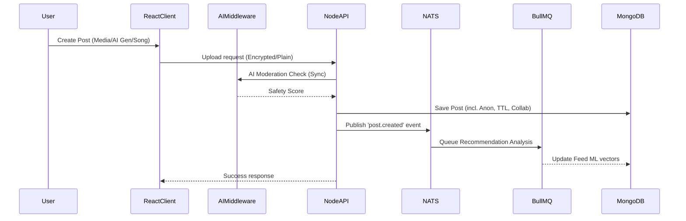

# Posts Management

## Create Post Flow

### Problem
Users need to upload large media files securely, collaborate with others, and leverage AI for content generation and moderation, all while ensuring system scalability.

### Features & Capabilities

- **AI Post Generation**: Users can generate images, videos, and captions entirely through integrated generative AI workflows.
- **Anonymous Posts**: Users can toggle anonymity, hiding their identity while publishing to the community.
- **Auto-Expiration**: Posts can be configured with an auto-expiration timestamp (TTL), automatically removing the document from the database and feed after the specified time.
- **Collaborators**: Users can invite other creators as collaborators. Both users share the post on their profiles once the invite is accepted (managed via real-time Socket updates).
- **Music & Song Integration**: Posts can include background music metadata (track ID, start/end times), managed through the audio microservice.

### Comprehensive Implementation Flow

### AI Moderation Flow
1. **Synchronous Check**: Before saving, text and media (if unencrypted or via server-side AI gen) pass through an AI moderation model.
2. **Decision**: 
   - *Safe*: Post proceeds.
   - *Flagged*: Post is held in a 'pending review' state.
   - *Toxic*: Post is immediately rejected with an error to the client.

### NATS Recommendation Worker Flow
1. **Event Dispatch**: Once a post is successfully created, the main Node API publishes an event to NATS.
2. **Worker Processing**: A dedicated BullMQ worker consumes this event, analyzing the post's content, tags, and category.
3. **Vector Update**: The worker updates the user's content graph and recalculates the recommendation vector, ensuring that followers and interested users see the post in their personalized feeds.

### Failure Handling
- **Upload Failure**: Local IndexedDB queue allows background retries.
- **Moderation Timeout**: Fail-safe blocks the post temporarily until a background job verifies it.
- **NATS Outage**: BullMQ gracefully retries event delivery.