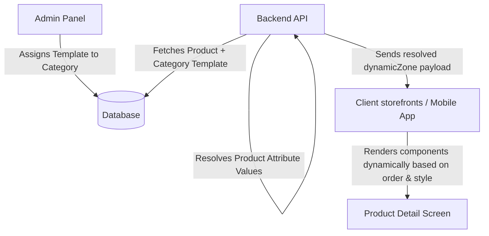

# Display Template Integration Guide (Client & App Teams)

This guide explains how to consume and render dynamic category-based layouts (Display Templates) in the client applications (iOS, Android, and Web storefronts). 

---

## 💡 System Overview

Instead of hardcoding a single static layout for all products (which fails when displaying diverse products like Electronics, Cakes, and Jewellery), the storefront layout is driven dynamically by **Display Templates** configured in the Admin Panel and associated with category levels.



---

## 📡 1. The API Response Payload

When requesting a product detail (e.g., `/products/:id` or `/product-groups/:id`), the backend API merges category-level templates with product attributes to produce a **`dynamicZone`** object.

### Example JSON Payload Structure:
```json
{
  "id": "prod_electronics_123",
  "name": "Sony WH-1000XM4 Wireless Headphones",
  "category": {
    "id": "cat_electronics",
    "name": "Headphones"
  },
  "dynamicZone": {
    "templateName": "electronics_grid",
    "templateVersion": "1.0",
    "sections": [
      {
        "id": "section_1721634567890",
        "componentKey": "KEY_SPECIFICATIONS",
        "title": "Technical Specs",
        "displayOrder": 0,
        "collapsible": true,
        "defaultCollapsed": false,
        "displayStyle": "grid",
        "fields": [
          { "key": "battery_life", "value": "30 Hours", "highlight": true },
          { "key": "noise_cancelling", "value": "Yes (Active)", "highlight": false }
        ]
      },
      {
        "id": "section_1721634589000",
        "componentKey": "PRODUCT_DESCRIPTION",
        "title": "About this Gift",
        "displayOrder": 1,
        "collapsible": false,
        "defaultCollapsed": false
      }
    ]
  }
}
```

---

## 🧩 2. Component Key Mappings

The backend returns a `componentKey` for each dynamic section. Your client application must map these keys to the corresponding UI components:

| Backend `componentKey` | Description | Recommended Client UI Component |
| :--- | :--- | :--- |
| **`PRODUCT_DESCRIPTION`** | Detailed HTML description of the product | Rich text or Markdown description widget |
| **`KEY_SPECIFICATIONS`** | Key specifications and specifications grid | Key-value table or grid layout component |
| **`PRODUCT_FEATURES`** | General features and store trust elements | Bulleted benefits or icons grid (Returns, Security, Support) |
| **`PERSONALISATION_WIDGET`** | Form fields for personalized/custom orders | Text boxes, text area, and image/file upload buttons |
| **`VOUCHER_DETAILS`** | Expiry dates and redemption instructions | Coupon box with copyable text and expiry alert |
| **`TAX_COMPLIANCE`** | HSN Code, GST Rate, and weight compliance | A compact borders-only table showing compliance data |
| **`SIZE_GUIDE`** | Size chart details and image guidelines | Clickable link/button that opens a size chart Modal |
| **`CARE_INSTRUCTIONS`** | fabric care, handling, washing guidelines | An bulleted text block with a care icon |
| **`DELIVERY_SLOT_PICKER`** | Vendor-enabled delivery time selectors | Date/Time Picker calendar UI widget |

---

## 🛠️ 3. Client Implementation Workflow

### Step A: Read Layout Config
1. If `dynamicZone` is absent, null, or empty, fallback to the client's **Default Static Layout**.
2. If `dynamicZone` is present, read `dynamicZone.sections` and sort them by `displayOrder`:
   ```javascript
   const orderedSections = [...dynamicZone.sections].sort(
     (a, b) => (a.displayOrder ?? 0) - (b.displayOrder ?? 0)
   );
   ```

### Step B: Build Active Blocks Sequence
Separate your screen layout into:
* **Static Header Zone**: Gallery, Brand, Title, Price, Quantity Selectors, and Action Buttons (Add to Cart / Save).
* **Dynamic Body Zone**: Map sorted dynamic sections to UI components in between.
* **Static Footer Zone**: Suggested Products, Reviews.

### Step C: Parse Section Settings
For each section, respect the rendering rules returned in the payload:
1. **Collapsible Accordion**: 
   * If `collapsible: true`, wrap the component in a collapsible accordion or disclosure panel.
   * Initialize its state (expanded or collapsed) using `defaultCollapsed`.
2. **Display Style**:
   * For `KEY_SPECIFICATIONS`, inspect `displayStyle` to adjust the layout structure:
     * `"badge"`: Render as simple chip badges (e.g. `Battery: 30 hours`).
     * `"table"`: Render as a 2-column key-value grid table.
     * `"list"`: Render as simple bullets.
     * `"grid"`: Render as visual square cards.
     * `"split"`: Separate key/important attributes (like *Material*, *Color*) into top cards, and put everything else inside an expandable table.
3. **Highlighting**:
   * If a field in `fields` has `highlight: true`, apply distinct styling (e.g., a subtle rose background, bold font, or a small badge) to draw the customer's eye.

---

## 🎨 4. Variant Selector Heuristics

The storefront variant selector configuration can be customized per category. Read the validation rules at `product.category.displayTemplate.validationRules.variantSelectorStyle` or from your product group:

```javascript
const selectorStyle = product?.category?.displayTemplate?.validationRules?.variantSelectorStyle;
```

* **`cards`**: Render options as visual clickable rectangular cards featuring thumbnails and price tags.
* **`standard`**: Render options as standard select dropdowns or simple pill buttons.
* **`auto`** *(Default)*: Fallback to your storefront's default heuristic (e.g., show visual cards if there are multiple style options, but standard pills for simple sizing).

---

## 🧑‍💻 5. Reference Code Implementation (React Native Example)

Here is a practical template for how your mobile app detail screen can render these blocks dynamically:

```jsx
import React from 'react';
import { ScrollView, View, Text } from 'react-native';
import Accordion from './components/Accordion';
import SpecsTable from './components/SpecsTable';
import PersonalisationForm from './components/PersonalisationForm';

export default function ProductDetailScreen({ product }) {
  const dynamicZone = product?.dynamicZone;

  // 1. Fallback to default blocks sequence if no template
  const getRenderSequence = () => {
    if (!dynamicZone?.sections?.length) {
      return ['PRODUCT_DESCRIPTION', 'KEY_SPECIFICATIONS', 'TAX_COMPLIANCE'];
    }
    return dynamicZone.sections
      .sort((a, b) => (a.displayOrder ?? 0) - (b.displayOrder ?? 0))
      .map(s => s.componentKey);
  };

  const renderDynamicSection = (componentKey) => {
    const section = dynamicZone?.sections?.find(s => s.componentKey === componentKey);
    if (!section) return null;

    const content = () => {
      switch (componentKey) {
        case 'KEY_SPECIFICATIONS':
          return (
            <SpecsTable 
              fields={section.fields || []} 
              style={section.displayStyle || 'table'} 
            />
          );
        case 'PRODUCT_DESCRIPTION':
          return <Text className="text-gray-600">{product.description}</Text>;
        case 'PERSONALISATION_WIDGET':
          return <PersonalisationForm fields={section.fields || []} />;
        // Add case statement mappings for other componentKeys ...
        default:
          return null;
      }
    };

    // Respect collapsible rules
    if (section.collapsible) {
      return (
        <Accordion 
          title={section.title} 
          defaultOpen={!section.defaultCollapsed}
          key={section.id}
        >
          {content()}
        </Accordion>
      );
    }

    return (
      <View key={section.id} className="py-4 border-b border-gray-100">
        <Text className="text-md font-bold mb-2">{section.title}</Text>
        {content()}
      </View>
    );
  };

  return (
    <ScrollView>
      {/* 1. Static Top Zone */}
      <ProductGallery images={product.images} />
      <ProductTitleAndPrice product={product} />
      <VariantSelector product={product} />

      {/* 2. Dynamic Zone */}
      <View className="px-4 py-2">
        {getRenderSequence().map(key => renderDynamicSection(key))}
      </View>

      {/* 3. Static Bottom Zone */}
      <SuggestedProducts productId={product.id} />
      <ReviewsSection productId={product.id} />
    </ScrollView>
  );
}
```
